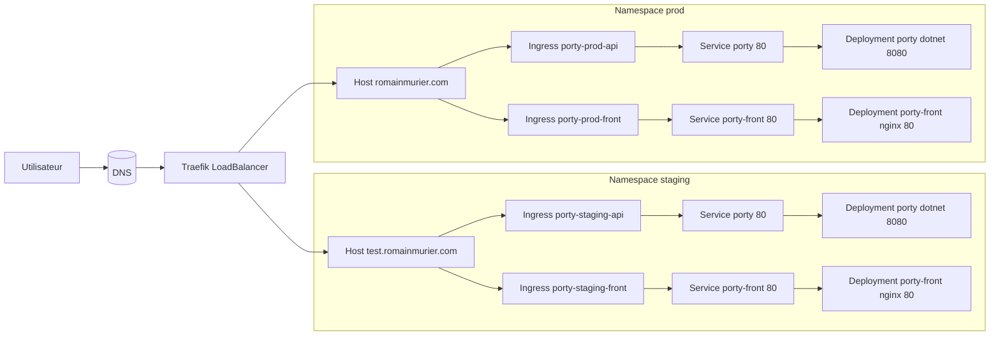
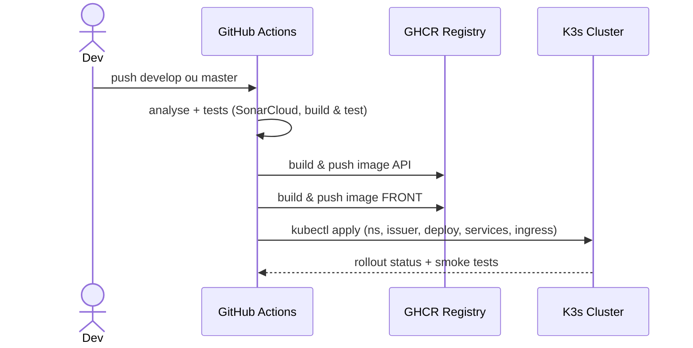

# Porty

Portfolio full-stack composé de :
- **Frontend** : React + TypeScript, servi statiquement par **NGINX**.
- **API** : .NET 8 (Code First).
- **Infra** : **K3s** (Kubernetes), **Traefik** (Ingress), **cert-manager** (TLS), **GHCR** (registry), **GitHub Actions** (CI/CD).

Deux environnements :
- **staging** → `test.romainmurier.com` (branche `develop`)
- **production** → `romainmurier.com` (branche `master`)

---

## Sommaire

1. [Architecture](#architecture)
2. [Arborescence](#arborescence)
3. [Prérequis](#prérequis)
4. [Installation locale](#installation-locale)
5. [CI/CD GitHub Actions](#cicd-github-actions)
6. [Déploiement Kubernetes](#déploiement-kubernetes)
7. [DNS et TLS](#dns-et-tls)
8. [Secrets GitHub et Base64](#secrets-github-et-base64)
9. [Debut](#debug)
10. [Commandes utiles](#commandes-utiles)

---

## Architecture

### Vue d'ensemble (Kubernetes)

> Diagramme **compat GitHub**



- **Routage**
  - `/api` → **Service porty:80** → pods API .NET écoutant sur 8080.
  - `/*` → **Service porty-front:80** (build React servi par NGINX).
- **Entrypoints Traefik** : `web` (80) et `websecure` (443).
- **TLS** : `ClusterIssuer/letsencrypt-prod`, secrets `*-tls` par namespace.

### Flux CI/CD



---

## Arborescence

```
k8s/
  cluster-issuer.yaml
  namespace-staging.yaml
  namespace-prod.yaml
  deployment.yaml            # API
  service.yaml               # API
  deployment-front.yaml      # FRONT
  service-front.yaml         # FRONT
  ingress-staging-api.yaml
  ingress-staging-front.yaml
  ingress-staging-front-http.yaml   # optionnel http only
  ingress-prod-api.yaml
  ingress-prod-front.yaml
  ingress-prod-front-http.yaml      # optionnel http only
.github/workflows/CICD.yml          # pipeline CI/CD
front/                               # app React TypeScript
api/                                 # API .NET 8
```

> Le workflow construit l'image **API** sans Dockerfile persistant (publish + commit sur `mcr.microsoft.com/dotnet/aspnet:8.0`) et génère à la volée un Dockerfile **NGINX** pour le front (avec fallback SPA).

---

## Prérequis

- **K3s** (ou Kubernetes) opérationnel, avec **Traefik** en `LoadBalancer` dans `kube-system`.
- **cert-manager** installé (CRDs + controller).
- `kubeconfig` valide (fourni à la CI via `KUBE_CONFIG`).
- Accès **GHCR** avec token PAT (`TOKEN_GITHUB`).
- **DNS** : enregistrements `A` vers l'IP du service `traefik` (LB).

Installer cert-manager rapidement (Helm) :
```bash
helm repo add jetstack https://charts.jetstack.io
helm repo update
kubectl create namespace cert-manager || true
helm upgrade --install cert-manager jetstack/cert-manager   --namespace cert-manager --set installCRDs=true
```

---

## Installation locale

### Front
```bash
cd front
npm ci
npm run dev     # dev server
npm run build   # génère dist/
```

### API (.NET 8)
```bash
cd api
dotnet restore
dotnet build -c Release

# Lancer en local sur 8080
# CMD :
set ASPNETCORE_URLS=http://0.0.0.0:8080 && dotnet run
# PowerShell :
# $env:ASPNETCORE_URLS="http://0.0.0.0:8080"; dotnet run
```

> La chaîne **ConnectionStrings__DefaultConnection** doit pointer sur ta base (SQL Server, etc.).  
> Si tu utilises EF Core : `dotnet ef database update` selon tes migrations.

---

## CI/CD GitHub Actions

- Branches gérées : `develop` → **staging**, `master` → **prod**.
- Étapes principales :
  1. Analyse & tests (SonarCloud, tests front, build & test API).
  2. Build images et **push GHCR** :
     - API → `ghcr.io/rmurier/porty:<sha>`
     - Front → `ghcr.io/rmurier/porty-front:<sha>`
  3. Déploiement K8s : namespaces, issuer, deployments, services, ingress.
  4. Sanity checks + smoke tests HTTP/HTTPS avec en-tête `Host`.

---

## Déploiement Kubernetes

### Namespaces
- `namespace-staging.yaml` → crée `staging`
- `namespace-prod.yaml` → crée `prod`

### ClusterIssuer
- `cluster-issuer.yaml` expose un `ClusterIssuer letsencrypt-prod` (HTTP-01).  

### Deployments & Services
- `deployment.yaml` : container API écoute **8080** ; `Service porty:80` cible le port **8080** des pods.
- `deployment-front.yaml` : NGINX sert `/usr/share/nginx/html` ; `Service porty-front:80`.

### Ingress
- Staging : `ingress-staging-api.yaml`, `ingress-staging-front.yaml`.
- Prod : `ingress-prod-api.yaml`, `ingress-prod-front.yaml`.
- Les Ingress **front** créent un `Certificate` nommé `*-tls` via cert-manager.

---

## DNS et TLS

1. Pointe les DNS :
   - `test.romainmurier.com` → IP du LB Traefik (`kubectl -n kube-system get svc traefik -o wide`)
   - `romainmurier.com` → même IP
2. Applique `cluster-issuer.yaml`.
3. Vérifie le certificat :
   ```bash
   kubectl -n staging get certificate,secret
   kubectl -n prod    get certificate,secret
   ```
4. (si besoin) Forcer TLS côté Traefik :
   ```bash
   kubectl -n staging annotate ingress porty-staging-front      traefik.ingress.kubernetes.io/router.tls=true --overwrite
   ```

---

## Secrets GitHub et Base64

### Secrets requis

| Secret GitHub            | Description |
|--------------------------|-------------|
| `KUBE_CONFIG`            | Contenu du kubeconfig (cluster K3s) |
| `TOKEN_GITHUB`           | PAT GitHub avec droits `write:packages` (push GHCR) |
| `SONAR_TOKEN`            | Token SonarCloud |
| `DOCKER_COMPOSE_DEV_B64` | **Base64** du compose dev avec `ConnectionStrings__DefaultConnection` |
| `DOCKER_COMPOSE_PROD_B64`| **Base64** du compose prod avec `ConnectionStrings__DefaultConnection` |


### Générer du Base64

**Windows PowerShell** :
```powershell
[Convert]::ToBase64String([IO.File]::ReadAllBytes("compose.dev.yml")) | Set-Clipboard
```

**Windows CMD** :
```cmd
certutil -encode compose.dev.yml compose.dev.yml.b64
```

**macOS** :
```bash
base64 -i compose.dev.yml | pbcopy
```

**Linux** :
```bash
base64 -w0 compose.dev.yml > compose.dev.yml.b64
```

---

## Debug

### 404 via Traefik
```bash
# Entrypoints bien annotés
kubectl -n staging annotate ingress porty-staging-front traefik.ingress.kubernetes.io/router.entrypoints=web,websecure --overwrite
kubectl -n staging annotate ingress porty-staging-api   traefik.ingress.kubernetes.io/router.entrypoints=web,websecure --overwrite

# Test HTTP avec Host
LB=$(kubectl -n kube-system get svc traefik -o jsonpath='{.status.loadBalancer.ingress[0].ip}')
curl -sI -H "Host: test.romainmurier.com" "http://$LB/index.html" | head -n1
```

### Certificat absent
```bash
kubectl get clusterissuer
kubectl -n staging get certificate,secret
kubectl -n staging describe certificate porty-staging-tls
```

### Namespace erroné
```bash
kubectl -n staging get ingress
kubectl -n prod get ingress
```

### Problème de pull image GHCR
```bash
kubectl -n staging get secret ghcr-secret -o yaml | head
```

---

## Commandes utiles

Lister rapidement Ingress + hosts + TLS :
```bash
kubectl -n staging get ingress   -o custom-columns=NAME:.metadata.name,HOSTS:.spec.rules[*].host,TLS:.spec.tls[*].secretName
```

Voir endpoints :
```bash
kubectl -n staging get svc porty porty-front -o wide
kubectl -n staging get endpoints porty porty-front
```
