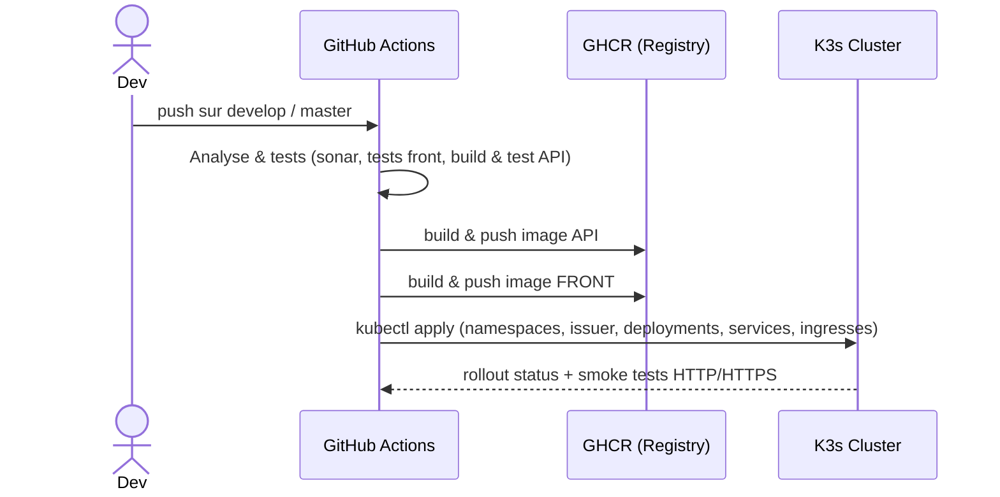

# Porty

Portfolio full-stack composé de :
- **Frontend** : React + TypeScript, servi statiquement par **NGINX**.
- **API** : .NET 8 (Code First).
- **Infra** : **K3s** (Kubernetes), **Traefik** (Ingress), **cert-manager** (TLS), **GHCR** (registry), **GitHub Actions** (CI/CD).

Deux environnements :
- **staging** → `test.murierromain.com` (branche `develop`)
- **production** → `murierromain.com` (branche `master`)

---

## Sommaire

1. [Architecture](#architecture)
2. [Arborescence du repo](#arborescence-du-repo)
3. [Prérequis](#prérequis)
4. [Installation locale (dev)](#installation-locale-dev)
5. [CI/CD (GitHub Actions)](#cicd-github-actions)
6. [Déploiement Kubernetes](#déploiement-kubernetes)
7. [DNS & TLS (Let's Encrypt)](#dns--tls-lets-encrypt)
8. [Secrets GitHub & encodage Base64](#secrets-github--encodage-base64)
9. [Dépannage (404, TLS, namespace, images)](#dépannage-404-tls-namespace-images)
10. [Commandes utiles](#commandes-utiles)

---

## Architecture

### Vue d’ensemble (Kubernetes)

```mermaid
flowchart LR
  U[Utilisateur] --> DNS[(DNS)]
  DNS --> LB[Traefik LB]

  %% Routes par hôte
  LB -- Host: test.murierromain.com --> ING_STG_API[Ingress porty-staging-api (/api)]
  LB -- Host: test.murierromain.com --> ING_STG_FRONT[Ingress porty-staging-front (/)]
  LB -- Host: murierromain.com --> ING_PROD_API[Ingress porty-prod-api (/api)]
  LB -- Host: murierromain.com --> ING_PROD_FRONT[Ingress porty-prod-front (/)]

  %% Staging
  ING_STG_API --> SVC_STG_API[Service porty :80]
  ING_STG_FRONT --> SVC_STG_FRONT[Service porty-front :80]
  SVC_STG_API --> DEP_STG_API[Deployment porty (.NET 8 :8080)]
  SVC_STG_FRONT --> DEP_STG_FRONT[Deployment porty-front (NGINX :80)]

  %% Prod
  ING_PROD_API --> SVC_PROD_API[Service porty :80]
  ING_PROD_FRONT --> SVC_PROD_FRONT[Service porty-front :80]
  SVC_PROD_API --> DEP_PROD_API[Deployment porty (.NET 8 :8080)]
  SVC_PROD_FRONT --> DEP_PROD_FRONT[Deployment porty-front (NGINX :80)]
```

- **Routage** :
  - `/<anything>` → **front** (`Service porty-front:80`)
  - `/api` → **API** (`Service porty:80` → Pods .NET qui écoutent en 8080)
- **Entrypoints Traefik** : `web` (80) + `websecure` (443)
- **TLS** : cert-manager via `ClusterIssuer` `letsencrypt-prod`, secrets `*-tls` par namespace.
- **Middleware Traefik** : **non utilisé** par défaut (CRD non installé).

### Flux CI/CD



---

## Arborescence du repo

> Fichiers clés (infra) :

```
k8s/
  cluster-issuer.yaml
  namespace-staging.yaml
  namespace-prod.yaml
  deployment.yaml            # API
  service.yaml               # API
  deployment-front.yaml      # FRONT
  service-front.yaml         # FRONT
  ingress-staging-api.yaml
  ingress-staging-front.yaml
  ingress-staging-front-http.yaml   # (optionnel, HTTP pur)
  ingress-prod-api.yaml
  ingress-prod-front.yaml
  ingress-prod-front-http.yaml      # (optionnel, HTTP pur)
.github/workflows/CICD.yml          # pipeline CI/CD
front/                               # app React TypeScript
api/                                 # API .NET 8
```

> Le workflow construit les images **sans Dockerfile permanent** pour l’API (publish + commit sur base `mcr.microsoft.com/dotnet/aspnet:8.0`) et génère un Dockerfile **à la volée** pour le front (NGINX + SPA fallback).

---

## Prérequis

- **K3s** (ou Kubernetes) opérationnel.
- **Traefik** en LoadBalancer dans `kube-system` (install par défaut sur K3s).
- **cert-manager** installé (CRDs + controller).
- **Accès au cluster** via un `kubeconfig` (fourni à la CI via `KUBE_CONFIG`).
- **GHCR** (GitHub Container Registry) accessible avec un token PAT.
- **DNS** : enregistrements **A** pour :
  - `test.murierromain.com` → IP publique du LB Traefik
  - `murierromain.com` → IP publique du LB Traefik

### (Optionnel) Installer cert-manager via Helm

```bash
helm repo add jetstack https://charts.jetstack.io
helm repo update
kubectl create namespace cert-manager || true
helm upgrade --install cert-manager jetstack/cert-manager   --namespace cert-manager   --set installCRDs=true
```

---

## Installation locale (dev)

### Front

```bash
cd front
npm ci
# Dev server (vite ou équivalent)
npm run dev
# Build
npm run build
```

### API (.NET 8)

```bash
cd api
dotnet restore
dotnet build -c Release

# Lancer en local (sur http://localhost:8080)
# cmd.exe :
set ASPNETCORE_URLS=http://0.0.0.0:8080 && dotnet run
# PowerShell :
# $env:ASPNETCORE_URLS="http://0.0.0.0:8080"; dotnet run
```

> **ConnectionStrings__DefaultConnection** doit pointer vers ta base (SQL Server, etc.).  
> Si EF Core (Code First) est utilisé : `dotnet ef database update` (ajuster selon ton setup).

---

## CI/CD (GitHub Actions)

Le workflow `.github/workflows/CICD.yml` orchestre :
- **Branches** : `develop` → staging, `master` → production.
- **Jobs** :
  - Analyse & tests (SonarCloud, tests front, build/test API).
  - Build & push images (API & Front) vers **GHCR**.
  - Déploiement K8s : namespaces, ClusterIssuer, Deployments, Services, Ingress (avec corrections d’annotations et namespace).
- **Images** : taguées `ghcr.io/rmurier/porty:<sha>` et `ghcr.io/rmurier/porty-front:<sha>`.

Secrets requis (voir section [Secrets GitHub & encodage Base64](#secrets-github--encodage-base64)).

---

## Déploiement Kubernetes

### Namespaces
- `k8s/namespace-staging.yaml` → `staging`
- `k8s/namespace-prod.yaml` → `prod`

### ClusterIssuer (TLS)
- `k8s/cluster-issuer.yaml` → `ClusterIssuer/letsencrypt-prod` (ACME HTTP-01 via Traefik).
- Ne pas ajouter de `privateKeySecretRef` spécifique, cert-manager gère la clé automatiquement.

### Deployments & Services
- `deployment.yaml` (API) : container écoute **8080** ; `Service porty:80` → back-end 8080.
- `deployment-front.yaml` (front) : NGINX ; `Service porty-front:80` → `/usr/share/nginx/html`.
- Probes adaptées (readiness/liveness) si nécessaire (`HEALTH_PATH` dans la CI, par défaut `/`).

### Ingress
- *Staging* : `ingress-staging-api.yaml`, `ingress-staging-front.yaml` (+ `ingress-staging-front-http.yaml` optionnel).
- *Production* : `ingress-prod-api.yaml`, `ingress-prod-front.yaml` (+ `ingress-prod-front-http.yaml` optionnel).
- La CI force/garantit les annotations suivantes :
  - `kubernetes.io/ingress.class: traefik`
  - `traefik.ingress.kubernetes.io/router.entrypoints: web,websecure`
  - `cert-manager.io/cluster-issuer: letsencrypt-prod`

---

## DNS & TLS (Let's Encrypt)

1. Crée des enregistrements **A** :
   - `test.murierromain.com` → IP du LB Traefik (`kubectl -n kube-system get svc traefik -o wide`)
   - `murierromain.com` → même IP
2. Déploie `cluster-issuer.yaml`.
3. Les Ingress front créent automatiquement un `Certificate` via `cert-manager` :
   ```bash
   kubectl -n staging get certificate,secret
   kubectl -n prod    get certificate,secret
   ```
4. (si nécessaire) Forcer TLS côté Traefik :
   ```bash
   kubectl -n staging annotate ingress porty-staging-front      traefik.ingress.kubernetes.io/router.tls=true --overwrite
   ```

---

## Secrets GitHub & encodage Base64

### Secrets requis

| Secret GitHub                  | Description |
|--------------------------------|-------------|
| `KUBE_CONFIG`                  | Contenu du kubeconfig (cluster K3s) |
| `TOKEN_GITHUB`                 | Token PAT pour `ghcr.io` (push images) |
| `SONAR_TOKEN`                  | Token SonarCloud |
| `DOCKER_COMPOSE_DEV_B64`       | **Base64** du compose (dev) avec `ConnectionStrings__DefaultConnection` |
| `DOCKER_COMPOSE_PROD_B64`      | **Base64** du compose (prod) avec `ConnectionStrings__DefaultConnection` |

**Extrait attendu dans les compose** (clé lue par la CI avec `yq`) :
```yaml
services:
  api:
    environment:
      ConnectionStrings__DefaultConnection: "Server=...;Database=...;User Id=...;Password=...;TrustServerCertificate=True;"
```

### Générer le Base64

**Windows (PowerShell) — copier dans le presse-papier :**
```powershell
[Convert]::ToBase64String([IO.File]::ReadAllBytes("compose.dev.yml")) | Set-Clipboard
```

**Windows (cmd.exe) — vers un fichier :**
```cmd
certutil -encode compose.dev.yml compose.dev.yml.b64
```

**macOS :**
```bash
base64 -i compose.dev.yml | pbcopy
```

**Linux :**
```bash
base64 -w0 compose.dev.yml | xclip -selection clipboard
# ou
base64 -w0 compose.dev.yml > compose.dev.yml.b64
```

### Créer les secrets GitHub (optionnel, via gh CLI)

```bash
gh secret set KUBE_CONFIG < ~/.kube/config
gh secret set TOKEN_GITHUB -b "ghp_xxx"
gh secret set SONAR_TOKEN  -b "sonar_xxx"
gh secret set DOCKER_COMPOSE_DEV_B64  < compose.dev.yml.b64
gh secret set DOCKER_COMPOSE_PROD_B64 < compose.prod.yml.b64
```

---

## Dépannage (404, TLS, namespace, images)

### 404 via Traefik
- Vérifier les entrypoints :
  ```bash
  kubectl -n staging annotate ingress porty-staging-front     traefik.ingress.kubernetes.io/router.entrypoints=web,websecure --overwrite
  kubectl -n staging annotate ingress porty-staging-api     traefik.ingress.kubernetes.io/router.entrypoints=web,websecure --overwrite
  ```
- Tester HTTP (avec Host header) :
  ```bash
  LB=$(kubectl -n kube-system get svc traefik -o jsonpath='{.status.loadBalancer.ingress[0].ip}')
  curl -sI -H "Host: test.murierromain.com" "http://$LB/index.html" | head -n1
  ```
- Regarder les logs Traefik :
  ```bash
  kubectl -n kube-system logs -l app.kubernetes.io/name=traefik --since=5m
  ```

### Certificat TLS absent ou non prêt
```bash
kubectl get clusterissuer
kubectl -n staging get certificate,secret
kubectl -n staging describe certificate porty-staging-tls
```

### Mauvais namespace dans les Ingress
> La CI force `metadata.namespace`, mais au besoin :
```bash
kubectl -n staging get ingress
kubectl -n prod get ingress
```

### Images introuvables (pull) / Secret manquant
```bash
kubectl -n staging get secret ghcr-secret -o yaml | head
# si absent, la CI crée/maintient automatiquement :
# kubectl -n <ns> create secret docker-registry ghcr-secret #   --docker-server=ghcr.io --docker-username=<user> --docker-password=<token>
```

### Vérif rapide des services/pods
```bash
kubectl -n staging get deploy,svc,ingress -o wide
kubectl -n staging get endpoints porty porty-front
kubectl -n staging get pods -o wide
```

---

## Commandes utiles

- **Lister les Ingress avec hosts/tls :**
  ```bash
  kubectl -n staging get ingress -o custom-columns=NAME:.metadata.name,HOSTS:.spec.rules[*].host,TLS:.spec.tls[*].secretName
  ```

- **Voir les endpoints des services :**
  ```bash
  kubectl -n staging get svc porty porty-front -o wide
  kubectl -n staging get endpoints porty porty-front
  ```

- **Debug local du Service Front :**
  ```bash
  kubectl -n staging port-forward svc/porty-front 18080:80
  curl -I http://127.0.0.1:18080/
  ```

---
